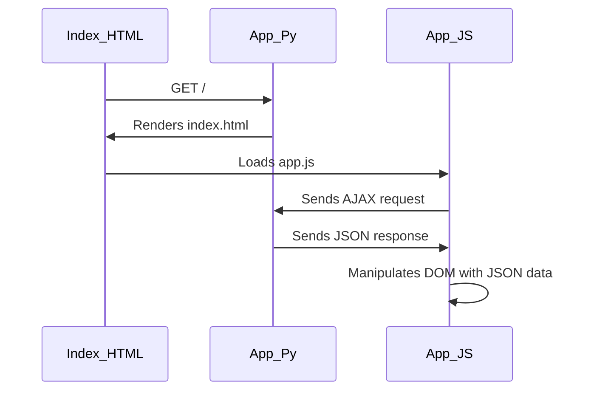

# Analysis-of-Rice-Price-Fluctuations-in-Late-Qing-Dynasty.
Analysis of Rice Price Fluctuations in Late Qing Dynasty.

```mermaid
sequenceDiagram
    participant Index_HTML
    participant App_Py
    participant App_JS
    Index_HTML->>App_Py: GET /
    App_Py->>Index_HTML: Renders index.html
    Index_HTML->>App_JS: Loads app.js
    App_JS->>App_Py: Sends AJAX request
    App_Py->>App_JS: Sends JSON response
    App_JS->>App_JS: Manipulates DOM with JSON data

```
